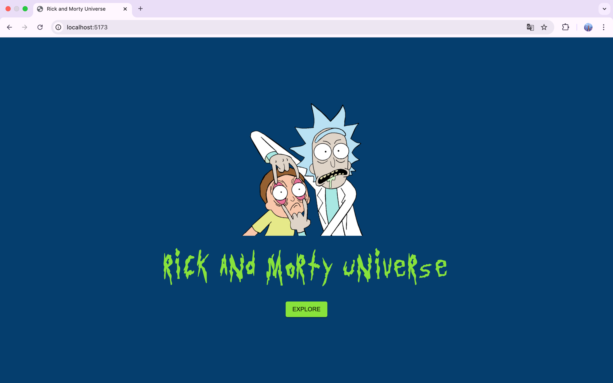
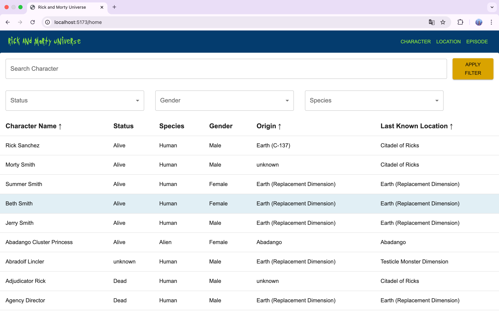
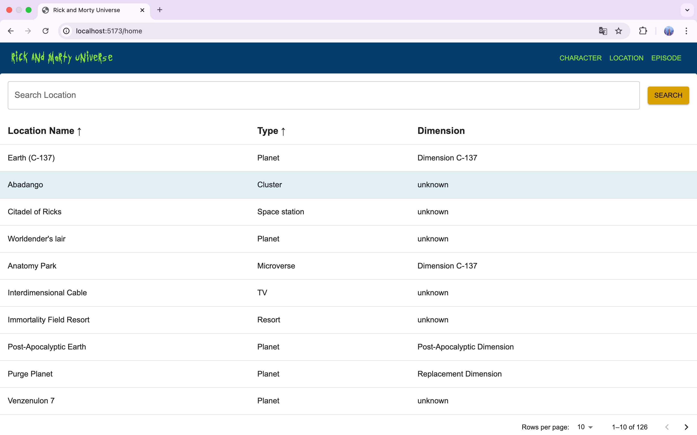
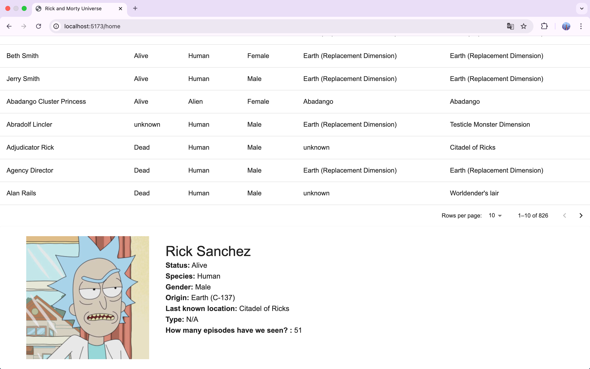
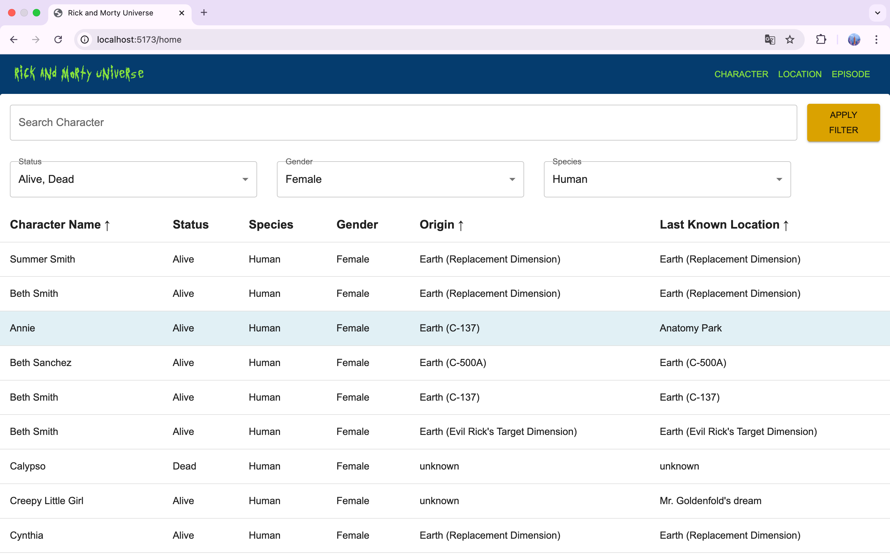

# Rick and Morty Universe API Project 🌌

This project is a modern React application built using the [Rick and Morty API](https://rickandmortyapi.com/), allowing users to explore **characters**, **locations**, **episodes**, and other related information. It is designed with **Material UI**, **Vite**, and **React Router**, providing a fast and elegant user interface.


## 🎯 Purpose of the Project

The purpose of this project is to practice skills in **React** and modern tools while creating a dynamic application that provides access to Rick and Morty universe data. It also serves as a practical example for developers to learn **Vite**, **Material UI**, and **React Router** usage.


## 🚀 Features

- **Home Page:** Displays a welcome screen on the first load.
- **Character Data:** Detailed sorting and filtering for characters. 
- **Location Data:** Dynamic tables to display all locations.  
- **Episode Data:** Dynamic tables to display all episodes. 
- **High Performance:** Optimized with Vite for fast performance.  
- **Material UI:** Modern and customizable UI components.  


## 🛠️ Technologies and Dependencies

This project is built with the following technologies and dependencies:

- **React**: For building the user interface.  
- **Vite**: For a fast development server and build tool.  
- **Material UI**: For modern and customizable UI components.  
  - `@mui/material`  
  - `@mui/icons-material`  
  - `@emotion/react`  
  - `@emotion/styled`  
- **React Router Dom**: For navigation and routing.  
- **Axios**: For fetching data from the API.  


## 📂 Project Structure

```plaintext
src/
├── assets/
│   ├── image/               # Images used in the project
│   ├── fonts/                # Custom fonts
├── components/
│   ├── AppBarHeader.jsx      # Top navigation bar
│   ├── DataTable.jsx         # Table component for characters
│   ├── LocationDataTable.jsx # Table component for locations
│   ├── EpisodeDataTable.jsx  # Table component for episodes
│   ├── CharacterDetails.jsx  # Card component for character details
│   ├── HomePage.jsx          # Welcome screen
├── theme/
│   ├── theme.js              # Global styles with theme awareness
├── App.jsx                   # Main application component
└── main.js                   # React rendering entry point

```

## ⚙️ Setup and Running the Project

1. Clone the Repository
```
git clone https://github.com/berilkln/rickandmorty-api.git
cd rickandmorty-api
cd rickandmorty
```
3. Install Dependencies
```
npm install
```
5. Run the Development Server
```
npm run dev
```
Open http://localhost:5173 in your browser to view the app.

## 📸 Screenshots

### Welcome Screen

### Characters Table   

### Locations Table

### Episodes Table   

### Character Details   

### Character Filter   



## 🚧 Development Notes

- A Welcome Screen is displayed upon the first load, followed by navigation to other screens.
- Thanks to Vite, the app is optimized for speed and smooth development.
- User-friendly error messages are displayed in case of any API errors.


## ✨ Acknowledgments

This project was built using the following resources:

[Rick and Morty API](https://rickandmortyapi.com/)  
[React Documentation](https://react.dev)  
[Material UI ](https://mui.com/)  
[React Router Documentation](https://reactrouter.com/home)   
[Rick and Morty Theme Colors](https://colorswall.com/palette/243091)   
[Vite Guide](https://vite.dev/guide/)


## 📧 Contact

If you have any questions about this project, feel free to reach out:

E-posta: berilk.dev@gmail.com

